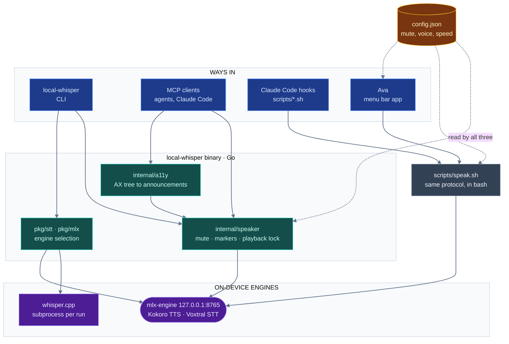

# local-whisper

Dictation, speech, and spoken Claude Code notifications for macOS, running
entirely on-device.

Cloud voice tools are a non-starter for anything you wouldn't paste into a
stranger's web form. Client calls, mostly. This keeps the loop local instead:
whisper.cpp or Voxtral for speech-to-text, Kokoro for speech. No audio and no
transcript leaves the machine.

It started as a Go CLI for dictation and grew into the stack around it: a menu
bar app, Claude Code hooks that speak session status out loud, and an MCP
server so other programs can use the same voice.

## Quick start

```bash
brew install sox whisper-cpp go

git clone https://github.com/iksnerd/local-whisper.git
cd local-whisper
make install-bin        # builds, downloads the 141MB model, installs to ~/.local/bin

export PATH="$HOME/.local/bin:$PATH"   # add to ~/.zshrc to make it stick

local-whisper           # speak; the text lands wherever your cursor is
```

Switch to the app you want to dictate into before running it — on a first run
your cursor is still in the terminal you just typed the command into, so your
words get pasted at your own shell prompt. That is the tool working, not
failing. Binding it to a hotkey (below) is what makes this natural.

`make install-bin` covers the default engine. `make setup` is the one-shot
version if you also want the Voxtral and Kokoro path: it installs the system
dependencies and downloads the model in one go.

Two macOS permission prompts on first run. **Microphone**, for whatever you
ran it from — if you miss or deny this one, recording still "succeeds" and
produces silence. And **Accessibility**, because auto-paste drives Cmd+V
through AppleScript (System Settings → Privacy & Security → Accessibility);
without it the transcript still reaches your clipboard, and
`local-whisper --no-paste` skips the attempt.

Prefer a hotkey? `make install-raycast` installs three Raycast script
commands: Raycast Settings → Extensions → Add Script Directory →
`~/raycast-scripts`, reload, then bind "Dictate with Whisper". The other two,
"Dictate with Voxtral" and "Toggle Voxtral Server", need Apple Silicon and the
Voxtral setup below.

The default engine works on any Mac. Voxtral, the TTS server and call
monitoring need Apple Silicon; they run through
[MLX](https://github.com/ml-explore/mlx).

## What it does

**Dictation** into whatever has focus. It records until you stop talking (2s of
silence), transcribes, copies, and pastes. Bind it to a hotkey through Raycast
or the menu bar app if you don't want to reach for a terminal.

Two speech-to-text engines sit behind that. `whisper.cpp` is the default and
needs nothing installed beyond the brew formula. Voxtral runs on a local MLX
server and does better on technical vocabulary, at the cost of a setup step.

**Speech** the other direction, from `local-whisper speak`, an MCP tool, a
shell script, or the menu bar app. They all go through one Kokoro server, one
global mute, and one playback lock, so two of them never talk over each other.

The rest of what's here:

- Claude Code hooks that say when Claude finishes a turn or needs a decision,
  optionally summarized down by a local Ollama model first.
- A menu bar app for one-click dictation, a system-wide mute shortcut, and live
  tuning of voice, speed, volume and message length.
- `voice-monitor`, which streams a live call transcript with optional speaker
  diarization, from the mic or a loopback device.
- An MCP server. `local-whisper mcp` hands any MCP client the same speech and
  transcription, plus accessibility-tree narration.
- Paired with [chrome-devtools MCP](https://github.com/ChromeDevTools/chrome-devtools-mcp),
  it reads a web page's accessibility tree the way a screen reader announces
  it. A rule-based audit won't tell you that six links all say "read more", or
  that an alt text which passes the linter reads as nonsense out loud.

## How it works

There are four ways in and two engines underneath. The Claude Code hooks don't go
through the Go binary at all. They're plain bash, so speech still works on a
machine where the binary was never installed.



That is also why one JSON file has three readers of its own. A contract test
holds them to the same answers: see
[`internal/voiceconfig`](internal/voiceconfig/contract_test.go) and `make
check-swift-config`.

## Privacy and permissions

Nothing is sent anywhere. Both engines run on your machine, `mlx-engine` binds
`127.0.0.1`, and there is no account, no telemetry and no server component. The
one network access is downloading model weights at setup time.

That still leaves artifacts on disk and two powerful macOS permissions, so
here is the whole of it.

**What gets written, and when it goes away**

| What | Where | Cleaned up |
| --- | --- | --- |
| Recorded dictation audio | `/tmp/voice-input/` | Deleted when the command exits. A crash or `kill -9` leaves the `.wav` behind. |
| Synthesis + playback temp files | `/tmp/ava-tts-*` | Deleted after playback. |
| **`voice-monitor` transcripts** | `/tmp/voice-input/transcript-<timestamp>.txt` | **Never.** Written mode `0644`, appended, and kept until you delete them or the OS clears `/tmp`. |

That last row is the one to know about. If you use `voice-monitor` on a call,
the full transcript stays on disk, world-readable, indefinitely. Pass `--log` to
choose the path, and delete it yourself when you're done.

**Permissions it asks for**

- **Microphone** — to record. If you deny it, recording still appears to work
  and produces silence.
- **Accessibility** — only for auto-paste, which drives Cmd+V through
  AppleScript. This permission allows synthesising *any* keystroke, not just
  Cmd+V, so grant it to something you trust. `local-whisper --no-paste` skips
  the attempt and leaves the transcript on your clipboard.
- **Reading other apps' accessibility trees** — `local-whisper a11y` and the
  `speak_accessibility_tree` MCP tool parse a snapshot you hand them. They read
  what you pass in; they don't scrape your screen on their own.

**Recording other people**

`make setup-blackhole` sets up a loopback device so `voice-monitor` can capture
a call — which means capturing the other participants. Recording-consent law
varies by jurisdiction and some require every party to agree. That's on you,
not on this tool.

**One local network hop worth naming**

The voice hooks can optionally shorten a notification through a local
[Ollama](https://ollama.com) model before speaking it. That sends the text to
`127.0.0.1:11434` on your machine — still local, but it is a second process
seeing the content. It's off unless you enable `llmSummary`.

## Common commands

```bash
local-whisper                              # dictate
local-whisper --engine voxtral             # dictate with the MLX engine
local-whisper transcribe meeting.wav       # transcribe a file you already have

local-whisper speak "build finished"
git log -1 --format=%s | local-whisper speak
local-whisper stop                         # cancel speech from any source
local-whisper voices                       # what --voice accepts

local-whisper engine start|status|stop     # the mlx-engine STT/TTS server
local-whisper mcp                          # serve the stack over MCP
local-whisper a11y snapshot.txt            # narrate an accessibility tree
```

Every flag and every command: [`docs/cli.md`](docs/cli.md).

## Documentation

- [`docs/cli.md`](docs/cli.md) — full command and flag reference, engine
  choice, context files.
- [`docs/mcp.md`](docs/mcp.md) — the MCP server: its tools, registering it, and
  pairing it with chrome-devtools MCP for accessibility work.
- [`docs/claude-code-voice-hooks.md`](docs/claude-code-voice-hooks.md) — spoken
  Claude Code notifications: setup, settings, message length and summarization.
- [`docs/troubleshooting.md`](docs/troubleshooting.md) — for when nothing
  pastes, or nothing plays.
- [`mlx-engine/README.md`](mlx-engine/README.md) — the local STT/TTS server:
  HTTP endpoints, models, running it standalone.
- [`AvaMenuBar/README.md`](AvaMenuBar/README.md) — the menu bar
  app.
- [`docs/voice-monitor.md`](docs/voice-monitor.md) — `voice-monitor`: BlackHole
  loopback setup, engine and language choice, diarization, known gaps.
- [`AGENTS.md`](AGENTS.md) — architecture and code style, for anyone (human or
  agent) working on this repo.

## Development

```bash
make build                 # binary to bin/local-whisper
make build-voice-monitor
make test                  # Go tests plus the voice-hooks pytest suite
make lint                  # vet, format check, ruff. Run before committing
make check-swift-config    # check the Swift config reader agrees with bash and Go
make check-paths           # fail on a hardcoded home directory (also runs in lint)
make clean
```

`go run ./cmd/local-whisper [flags]` runs without building. The package layout
and the conventions behind it are in [`AGENTS.md`](AGENTS.md), which tracks the
code.

## License

MIT
