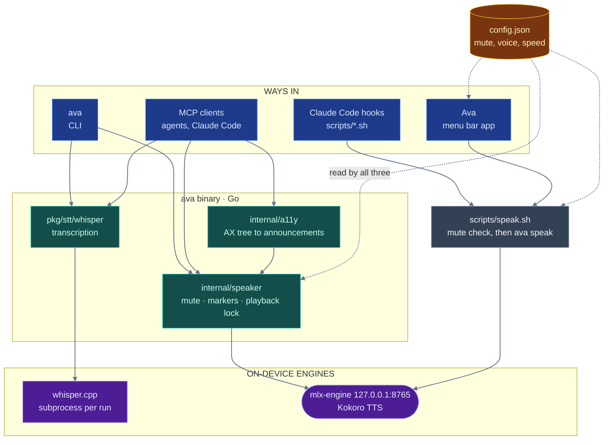

# Architecture

[← Back to the README](../README.md)

Four ways in, two engines underneath, and one config file that all of them read.

`ava-monitor`, the live call-transcript binary, is not in this picture: it
shares none of these paths. It streams through Voxtral in `voxtral/` rather
than whisper.cpp, speaks nothing, and serves its transcript on
`127.0.0.1:8766`. See [`ava-monitor.md`](ava-monitor.md) and
[`voxtral-architecture.mmd`](voxtral-architecture.mmd).

## Why the hooks speak through the Go binary

The Claude Code hooks and the menu bar app call `scripts/speak.sh`, which checks
the mute and hands off to `ava speak --async`. It used to synthesize and play
by itself, so that speech worked without a built binary, at the cost of a
second implementation of the player and its stop handling. A stop race fixed in
the Go player survived in the bash one; with one implementation, that class of
bug has nowhere to hide. The hooks now need `ava` built (`make build`) or
installed, and `speak.sh` fails with a message saying so when it is missing.

## Why one config file has three readers

`~/Library/Application Support/ava/config.json` is parsed independently by Go
(`internal/voiceconfig`), bash (`scripts/lib.sh`, for the hooks' mute and the
engine auto-start only) and Swift (`VoiceSettings.swift`) — because each of
those runs in a context where the others are unavailable. They must agree, including on malformed input, so
`internal/voiceconfig/contract_test.go` runs the bash and Go readers against
shared cases in `testdata/voice-config-cases.json`, and `make
check-swift-config` is the Swift arm.

The one config bug that ever shipped was a wrong-typed value silently unmuting
the app — in the one component nothing could test at the time.

## Why speech is a cross-process protocol

A global mute, an activity marker at `/tmp/ava-tts-active`, and an exclusive
`flock(2)` on `/tmp/ava-tts-playback.lock` are shared by every `ava` process
that speaks (the CLI, the MCP server, the hooks and the menu bar through
`speak.sh`), the menu bar's indicator and every stop path. Two of them speaking over each other
is the failure this prevents. `internal/speaker`'s package comment has the
details.

## One source for the constants every runtime shares

`internal/protocol/protocol.json` holds the values more than one language has
to agree on: the TTS activity directory and its env override, the playback
lock, the sidecar suffixes, mlx-engine's URL and pid file, and the temp dir.
`make generate-protocol` renders it into four files — `protocol_gen.go`,
`scripts/protocol.sh`, `AvaMenuBar/.../Protocol.swift` and
`mlx-engine/protocol.py` — all committed, none edited by hand.

It generates rather than having each runtime read one file at startup because
the runtimes cannot agree on a path that exists: `go:embed` cannot reach
outside its own package, an installed `ava` has no `scripts/` beside
it, and the menu bar app ships only what its bundle carries. A file read at
runtime would serve two of the four and leave hand-written copies for the rest,
which is worse than no generator, because the copies would look authoritative.

Two things check it. `make check-protocol` re-renders and fails if anything on
disk differs, and `internal/protocol/contract_test.go` fails when a protocol
value is spelled by hand anywhere outside a generated file — because a
generator guarantees its own output is correct, not that anybody reads it.

One consumer is deliberately not generated: `mlx-engine/Makefile` passes
`--port 8765` to uvicorn, and make cannot source a shell file for one word
without more machinery than the line is worth. It stays pinned by
`TestPortAgreesAcrossEveryRuntimeThatSpellsIt` in `pkg/mlx` instead — the
honest outcome of generation, which covers most consumers rather than all.

## The engine travels inside the binary

`internal/enginedist` embeds the mlx-engine bundle — the control script and the
three shell files it sources, plus `server.py`, `protocol.py`, `pyproject.toml`,
`uv.lock` and `.python-version` — so `ava setup` can install Kokoro on
a machine with no checkout. About 600 KB travels; the 1.2 GB venv is resolved by
`uv` at install time and the 339 MB model is fetched on first use.

`make generate-enginedist` copies the canonical files into
`internal/enginedist/files` (go:embed cannot reach outside its own package) and
`make check-enginedist` fails when a copy is stale. The generator **enumerates**
`mlx-engine/` rather than listing it, because the hand-written list drifted
twice in the hour it existed: `server.py`'s `import protocol` killed the first
real install after `uv` had already resolved a gigabyte, and a missing
`.python-version` then let `uv` pick its own Python. The embed pattern is
`all:files` for the same reason — a plain `files` silently skips dot-prefixed
entries, which is exactly what `.python-version` is.

## The checks that hold this together

`make lint` runs `go vet`, the format check, `ruff check`, the two generator
checks above (`check-protocol`, `check-enginedist`) and three scripts, each
written after the bug it now prevents:

- `scripts/check-portable-paths.sh` (`make check-paths`) fails on a hardcoded
  `/Users/<name>` in any tracked file. It was written after a PATH entry in `scripts/lib.sh` and a
  dev-checkout fallback in `Paths.swift` both shipped.
- `scripts/check-filenames.sh` (`make check-names`) fails on a tracked filename
  that breaks another checkout: a character outside `A-Za-z0-9._-`, a leading
  dash, a Windows reserved device name, or two paths differing only by case. It
  exists because every other guard here reads file *contents*, so a file named
  ``c -l)|count=$(list_files …`` — a shell fragment a mistyped redirect turned
  into a filename — was committed, pushed and survived every green run. `|` is
  illegal on NTFS, so that one also broke the clone on Windows outright.
- `scripts/check-doc-coverage.sh` (`make check-docs`) fails when a Makefile
  target or a `scripts/*.sh` is mentioned in no markdown file.
  `make setup-blackhole` and `make setup` both existed for months, documented
  nowhere. It caught itself on the first run, which is the correct behaviour.

A fourth, `AvaMenuBar/scripts/check-config-contract.py`, runs outside `make
lint`. It extracts `VoiceConfig` from the Swift source, compiles it, and runs
it against the same cases the Go and bash readers face. It is `make
check-swift-config`, kept out of both `make lint` and `make test` because it
needs `swiftc`.

## Environment variables

Every variable the code reads. Most exist so a test can point a reader at a
throwaway path instead of the real one; nothing in normal operation sets those.

| Variable | Read by | Does |
|---|---|---|
| `TTS_SPEED`, `TTS_VOLUME`, `TTS_SAY_RATE` | `internal/voiceconfig` (so `speak.sh` too, through `ava speak`) | Override the configured speed, volume and `say` rate for one run. See [the hooks doc](claude-code-voice-hooks.md#settings) |
| `TTS_NOTIFY_MAX_CHARS`, `TTS_STOP_MAX_CHARS` | `scripts/hook-notify.sh`, `scripts/hook-stop.sh` | Override the spoken-length caps |
| `MLX_ENGINE_SCRIPT` | `internal/speaker` | Control script that `speak`'s implicit auto-start runs. See [the CLI reference](cli.md#engine-server) |
| `AVA_ENGINE_DIR` | `internal/enginedist` | Where `ava setup` installs the engine bundle, and where auto-start looks for it |
| `AVA_BIN` | `scripts/install.sh` | Install directory, default `~/.local/bin` |
| `MLX_ENGINE_PID_FILE` | `mlx-engine/server.py` | The pid file the server removes on idle exit. `scripts/mlx-engine-server.sh` sets it so the two cannot disagree; also a test hook |
| `VOICECONFIG_PATH` | `internal/voiceconfig` | Test hook: the config file the Go reader loads |
| `VOICE_CONFIG_FILE`, `VOICE_DEFAULTS_FILE` | `scripts/lib.sh` | Test hook: the config and defaults files the bash reader loads, so the contract test can hand both readers the same fixture |
| `AVA_ENGINE_PID_FILE`, `AVA_ENGINE_LOG`, `AVA_ENGINE_LOCKDIR`, `AVA_ENGINE_URL` | `scripts/mlx-engine-server.sh` | Test hook: throwaway pid file, log, start lock and URL, so the engine-script tests in `cmd/ava/engine_script_test.go` never touch the real engine |
| `TTSCONTROL_ACTIVITY_DIR` | `internal/ttsproto`, `scripts/stop-speaking.sh` | Test hook: the speech activity-marker directory. The menu bar app and mlx-engine always use `/tmp/ava-tts-active` |
| `AVA_PLAYBACK_LOCK` | `internal/ttsproto` | Test hook: the playback lock, so a test that really plays does not queue behind speech on the machine |

The test suites also set a few variables (`AFPLAY_LOG`, `SOX_LOG`,
`WHISPER_LOG` and similar) that only their stub binaries read.
