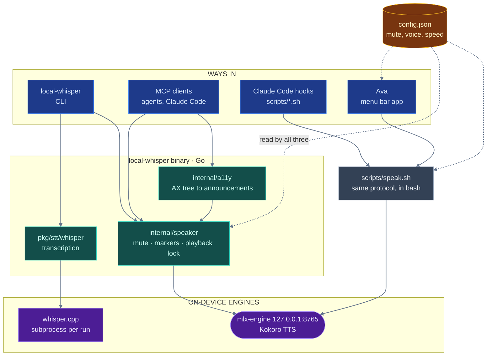

# Architecture

[← Back to the README](../README.md)

Four ways in, two engines underneath, and one config file that all of them read.

## Why the hooks bypass the Go binary

The Claude Code hooks are plain bash talking to `scripts/speak.sh`, not to
`local-whisper`. That is deliberate: speech still works on a machine where the
Go binary was never installed, which is the common case for someone who cloned
the repo to get spoken notifications and nothing else.

## Why one config file has three readers

`~/Library/Application Support/ava/config.json` is parsed independently by Go
(`internal/voiceconfig`), bash (`scripts/lib.sh`) and Swift
(`VoiceSettings.swift`) — because each of those runs in a context where the
others are unavailable. They must agree, including on malformed input, so
`internal/voiceconfig/contract_test.go` runs the bash and Go readers against
shared cases in `testdata/voice-config-cases.json`, and `make
check-swift-config` is the Swift arm.

The one config bug that ever shipped was a wrong-typed value silently unmuting
the app — in the one component nothing could test at the time.

## Why speech is a cross-process protocol

A global mute, an activity marker at `/tmp/ava-tts-active`, and an exclusive
`flock(2)` on `/tmp/ava-tts-playback.lock` are shared by the Go binary,
`speak.sh`, the menu bar app and the hooks. Two of them speaking over each other
is the failure this prevents. `internal/speaker`'s package comment has the
details.

## One source for the constants every runtime shares

`internal/protocol/protocol.json` holds the values more than one language has
to agree on: the TTS activity directory and its env override, the playback
lock, the sidecar suffixes, mlx-engine's URL and pid file, and the temp dir.
`make generate-protocol` renders it into four files — `protocol_gen.go`,
`scripts/protocol.sh`, `AvaMenuBar/.../Protocol.swift` and
`mlx-engine/protocol.py` — all committed, none edited by hand.

It generates rather than having each runtime read one file at startup because
the runtimes cannot agree on a path that exists: `go:embed` cannot reach
outside its own package, an installed `local-whisper` has no `scripts/` beside
it, and the menu bar app ships only what its bundle carries. A file read at
runtime would serve two of the four and leave hand-written copies for the rest,
which is worse than no generator, because the copies would look authoritative.

Two things check it. `make check-protocol` re-renders and fails if anything on
disk differs, and `internal/protocol/contract_test.go` fails when a protocol
value is spelled by hand anywhere outside a generated file — because a
generator guarantees its own output is correct, not that anybody reads it.

One consumer is deliberately not generated: `mlx-engine/Makefile` passes
`--port 8765` to uvicorn, and make cannot source a shell file for one word
without more machinery than the line is worth. It stays pinned by
`TestPortAgreesAcrossEveryRuntimeThatSpellsIt` in `pkg/mlx` instead — the
honest outcome of generation, which covers most consumers rather than all.

## The checks that hold this together

Four scripts run in `make lint`, each written after the bug it now prevents:

- `scripts/check-portable-paths.sh` (`make check-paths`) fails on a hardcoded
  `/Users/<name>` in any tracked file. It was written after a PATH entry in `scripts/lib.sh` and a
  dev-checkout fallback in `Paths.swift` both shipped.
- `scripts/check-filenames.sh` (`make check-names`) fails on a tracked filename
  that breaks another checkout: a character outside `A-Za-z0-9._-`, a leading
  dash, a Windows reserved device name, or two paths differing only by case. It
  exists because every other guard here reads file *contents*, so a file named
  ``c -l)|count=$(list_files …`` — a shell fragment a mistyped redirect turned
  into a filename — was committed, pushed and survived every green run. `|` is
  illegal on NTFS, so that one also broke the clone on Windows outright.
- `scripts/check-doc-coverage.sh` (`make check-docs`) fails when a Makefile
  target or a `scripts/*.sh` is mentioned in no markdown file.
  `make setup-blackhole` and `make setup` both existed for months, documented
  nowhere. It caught itself on the first run, which is the correct behaviour.
- `AvaMenuBar/scripts/check-config-contract.py` extracts `VoiceConfig` from the
  Swift source, compiles it, and runs it against the same cases the Go and bash
  readers face. It is `make check-swift-config`, kept out of `make test` because
  it needs `swiftc`.
